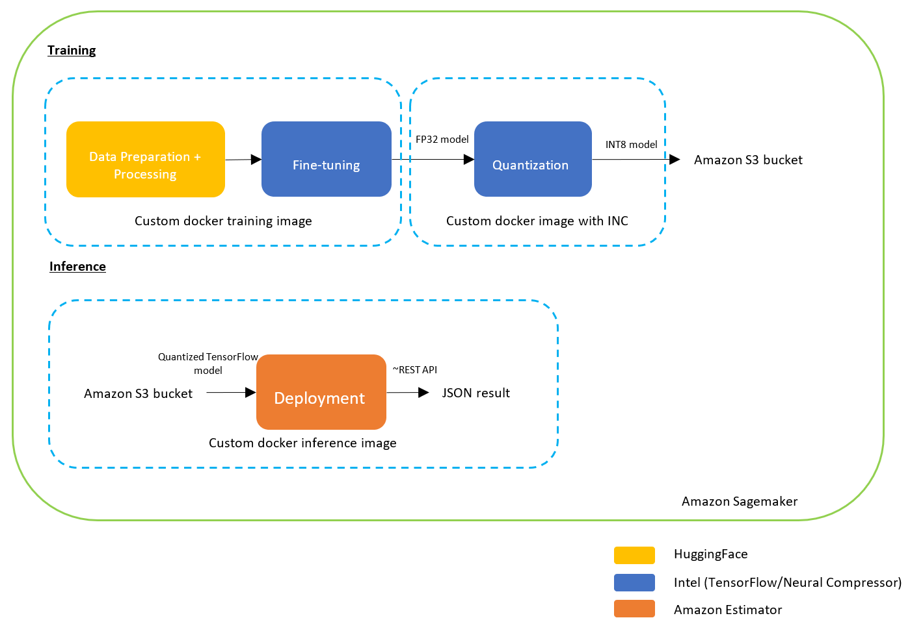
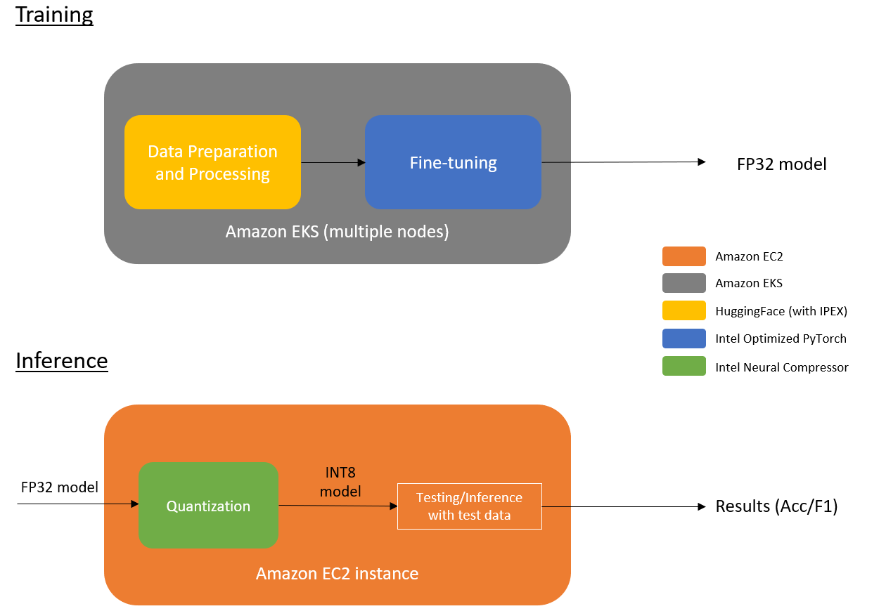

# Cloud Training and Cloud Inference on Amazon Sagemaker/Elastic Kubernetes Service

This is a workflow to demonstrate how users utilize the Intel’s hardware (Cascade Lake or above) and related optimized software to perform cloud training and inference on Amazon Sagemaker platform. The main software packages used here are: HuggingFace, Amazon SageMaker, Intel Optimized TensorFlow and Intel Neural Compressor

## Table of Contents 
- [Implementation Details](#implementation-details)
    - [Architecture](#architecture)
    - [Model Spec](#model-spec)
    - [Dataset](#dataset)
- [Getting Started](#installation)
    - [Prerequisites](#prerequisites)
    - [Installation](#installation)
- [Usage](#usage)
    - [Training](#sagemakereks-training)
    - [Inference](#sagemakereks-inference)
- [License](#license)

## Implementation Details
This workflow ultilizes the infracsture provided by the Amazon. There are two versions provided by this workflow - EKS and SageMaker.

### Architecture 

Sagemaker:
<br>

<br>
<br>
<br>
<br>
EKS:
<br>


### Model Spec
The uncased BERT base model is used to demonstrate this workflow.

```python
bert-base-uncased-config = {
  "architectures": [
    "BertForMaskedLM"
  ],
  "attention_probs_dropout_prob": 0.1,
  "gradient_checkpointing": false,
  "hidden_act": "gelu",
  "hidden_dropout_prob": 0.1,
  "hidden_size": 768,
  "initializer_range": 0.02,
  "intermediate_size": 3072,
  "layer_norm_eps": 1e-12,
  "max_position_embeddings": 128,
  "model_type": "bert",
  "num_attention_heads": 12,
  "num_hidden_layers": 12,
  "pad_token_id": 0,
  "position_embedding_type": "absolute",
  "transformers_version": "4.21.1",
  "type_vocab_size": 2,
  "use_cache": true,
  "vocab_size": 30522
}
```

### Dataset 
Microsoft Research Paraphrase Corpus is used as the dataset for training and testing. 

| **Type**                 | **Format** | **Rows** 
| :---                     | :---       | :---     
| Training Dataset         | HuggingFace Dataset  | 3668
| Testing  Dataset         | HuggingFace Dataset  | 1725

## Getting Started
### Prerequisites
#### Hardware
| **Name**                          | **Description**
| :---                              | :---
| CPU                               | Intel CPU - Cascade Lake or above
| Usable RAM                        | 16 GB
| Disk Size                         | 256 GB

#### Software
Docker is required to start this workflow. You will also need AWS credentials and the related AWS CLI installed on the machine to push data/docker image to the Amazon ECR.

For setting up the AWS credential account, you may refer to the following link:
<br>
https://aws.amazon.com/account/

For configuring the AWS credentials, you may refer to the following link:
<br>
https://docs.aws.amazon.com/cli/latest/userguide/cli-chap-configure.html

### Installation
1. Clone the repository
```
git clone https://github.com/intel/NLP-Workflow-with-AWS.git
cd NLP-Workflow-with-AWS
```
2. Build the docker image to prepare the environment for running the Juypter notebooks.
```
cd scripts
sh build_main_image.sh
```

## Usage 
Use the built docker image (by build_main_image.sh) to run the Juypter notebooks. Execute the following command:
```bash
cd scripts
sh start_script.sh
```

### Sagemaker/EKS Training 
After starting the container (i.e. executing the step in 'Usage'), execute the following command in the interactive shell.
```bash
cd /root/notebooks
jupyter notebook --allow-root
```
Start the notebook that is named as training and eks/sagemaker.

### Sagemaker/EKS Inference
After starting the container (i.e. executing the step in 'Usage'), execute the following command in the interactive shell.
```bash
cd /root/notebooks
jupyter notebook --allow-root
```
Start the notebook that is named as inference and eks/sagemaker.

## License 

[License](LICENSE)
